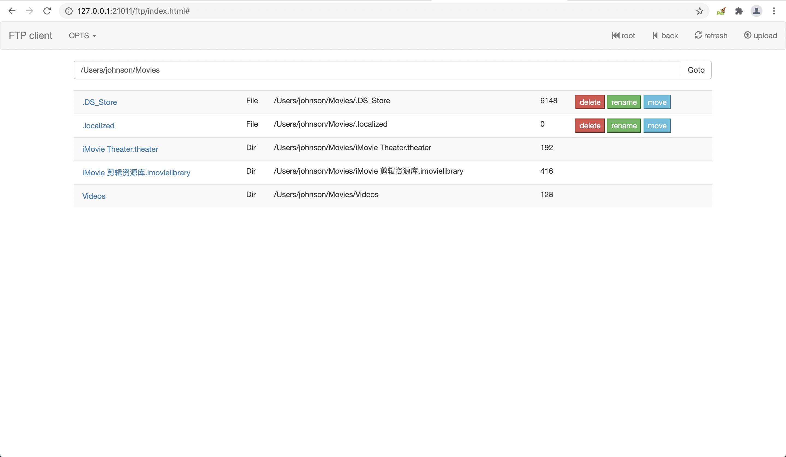

# java-ftp-server
A simple spring-boot web application provides several rest-apis to operating files in deployed host machine.

## project structure
```
|- java-ftp-server
    |- src
        |- main
            |- bin          starup scripts
            |- java         java source code
            |- resources    java resource files
    |- assembly.xml         assembly descicription file
    |- pom.xml              maven project description file
```

## package structure
```
|- ftp-server
    |- lib          libruaries
    |- startup.bat  startup script for windows
    |- startup.sh   startup script for unix/linux/macos
```

## installation
### clone source code
```
git clone 'https://github.com/johnsonmoon/java-ftp-server.git'
```

### build source code
```
cd java-ftp-server
mvn clean package -Dmaven.test.skip=true
```

### upload tar.gz package to your host machine
```
scp xxx.tar.gz ${user}@${IP}:${directory}
```

### extract tar.gz package
```
tar -xzf xxx.tar.gz
```

### start server (jre required, >= 1.7)
```
cd ftp-server
./startup.sh
```


## change server port
### stop server, modify startup script, like this:
```
kill -9 ${PID}

vi startup.sh
```

### add vm option like this:
```
java -Dserver.port=${port} -cp ${CLASSPATH} com.github.johnsonmoon.java.ftp.server.Main
```

## usage
using web browser to visit server
```
http://${IP}:${port}
```

finally you can see this:  

